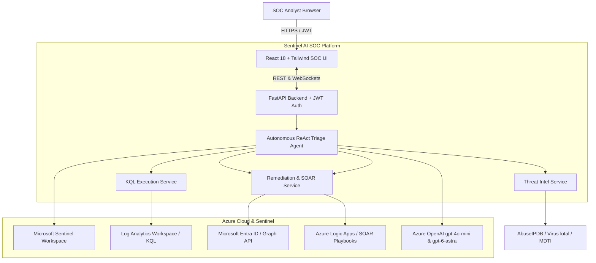

# 🛡️ Microsoft Sentinel AI SOC Agent - Autonomous Incident Triage Platform

<div align="center">

[](https://opensource.org/licenses/MIT)
[](https://www.python.org/)
[](https://fastapi.tiangolo.com/)
[](https://react.dev/)
[](https://tailwindcss.com/)
[](https://azure.microsoft.com/en-us/products/microsoft-sentinel)
[](https://www.microsoft.com/en-us/security/business/threat-protection/endpoint-defender)
[](#-testing--verification)
[](docker-compose.yml)
[](aks/)

**An enterprise-grade, autonomous AI SOC analyst agent built for Microsoft Sentinel, Microsoft Defender XDR, and Azure Entra ID.**

[Explore Features](#-key-platform-capabilities) • [Instant Setup](#-instant-3-minute-setup-guide) • [Permissions Guide](#-azure-service-principal--permissions-matrix) • [Architecture](#%EF%B8%8F-system-architecture) • [Deployment](#-docker-container-deployment)

</div>

---

## 🌟 Overview

The **Microsoft Sentinel AI SOC Agent** is an autonomous Tier-1 & Tier-2 cybersecurity platform engineered to accelerate threat triage from **20+ minutes down to 5 seconds**. 

Built with a ReAct (Reasoning + Acting) decision loop and dynamic hybrid model segregation (`gpt-4o-mini` & `gpt-6-astra`), the agent automatically queries Azure Log Analytics telemetry via dynamic KQL, cross-references multi-source Threat Intelligence feeds, maps attacks to MITRE ATT&CK tactics, generates publication-ready executive briefings, and triggers 1-click SOAR playbooks directly inside Microsoft Sentinel.

---

## 🚀 What's New in the Latest Release

- ⚡ **Interactive SOAR Playbook Selector:** Click **"Run Playbook"** on any incident to search, filter by category (`Containment`, `Identity`, `Network`, `Notification`, `Ticketing`, `Forensics`), and trigger live Azure Logic Apps (`Microsoft.Logic/workflows`) or built-in SOAR workflows with custom execution tracking notes and auto-synced Sentinel audit comments.
- 🧠 **Intelligent Hybrid AI Model Segregation:** Seamlessly routes routine, single-alert low-severity triage (~80% volume) to `gpt-4o-mini` for maximum token economy while escalating complex multi-stage/high-severity incidents (~20% volume) to `gpt-6-astra` for deep forensic root-cause analysis.
- 🔒 **First-Run Ephemeral Passwords & Zero-Trust Security:** Ephemeral startup passwords generated via `secrets.token_urlsafe(12)` on boot, with mandatory first-login password reset modals enforcing strong credentials before console access.
- 📄 **Executive Briefing Export Suite:** Instant 1-click exports of publication-ready Executive Incident Reports in **PDF** (WeasyPrint formatted), **Microsoft Word (.docx)**, **Markdown**, and **JSON** with dynamic AI model stamps.
- 👥 **Live Microsoft Entra ID Directory Assignment:** Assign incidents directly to SOC analysts and engineers fetched in real-time from your live Microsoft Entra ID (Azure AD) tenant.
- 🏷️ **NIST-Compliant Mandatory Closure Modal:** Requires explicit SOC classification (`TruePositive`, `FalsePositive`, `BenignPositive`, `Undetermined`) and detailed closing reasons before resolving incidents.

---

## 🚀 Instant 3-Minute Setup Guide

### 🍏 On macOS (New MacBook / Mac Studio)

Open **Terminal** on your Mac (`Cmd + Space` $\rightarrow$ type `Terminal` $\rightarrow$ Enter) and run:

```bash
# Step 1: Install Prerequisites via Homebrew (if not already installed)
brew install python@3.11 node

# Step 2: Clone the Repository
git clone https://github.com/ankush351992/AI-SOC-Agent-for-Microsoft-Sentinel.git
cd AI-SOC-Agent-for-Microsoft-Sentinel

# Step 3: Setup & Start Backend (Terminal 1)
cd backend
python3.11 -m venv venv
source venv/bin/activate
pip install --upgrade pip
pip install -r requirements.txt
cp .env.example .env    # (Paste your Azure & OpenAI credentials into .env)
uvicorn app.main:app --host 127.0.0.1 --port 8000 --reload
```

In a **New Terminal Tab** (`Cmd + T`):
```bash
# Step 4: Setup & Start Frontend (Terminal 2)
cd AI-SOC-Agent-for-Microsoft-Sentinel/frontend
npm install
npm run dev
```

> 🌐 Open your browser at **`http://localhost:3000`**

---

### 🪟 On Windows (PowerShell / Windows Terminal)

Open **PowerShell** and run:

```powershell
# Step 1: Clone the Repository
git clone https://github.com/ankush351992/AI-SOC-Agent-for-Microsoft-Sentinel.git
cd AI-SOC-Agent-for-Microsoft-Sentinel

# Step 2: Setup & Start Backend (PowerShell Window 1)
cd backend
python -m venv venv
.\venv\Scripts\activate
pip install --upgrade pip
pip install -r requirements.txt
Copy-Item .env.example .env    # (Paste your Azure & OpenAI credentials into .env)
uvicorn app.main:app --host 127.0.0.1 --port 8000 --reload
```

In a **Second PowerShell Window**:
```powershell
# Step 3: Setup & Start Frontend (PowerShell Window 2)
cd AI-SOC-Agent-for-Microsoft-Sentinel\frontend
npm install
npm run dev
```

> 🌐 Open your browser at **`http://localhost:3000`**

---

### 🔑 First-Run Authentication & Security

To prevent hardcoded default credentials in production, initial passwords for all built-in accounts (`soc_admin`, `analyst`, `tier1_analyst`) are generated randomly on application startup using a cryptographically secure generator (`secrets.token_urlsafe(12)`) and output in the backend startup logs:

```text
================================================================================
[SECURITY NOTICE] All user accounts initialized with random temporary credentials.
Every user MUST reset their password on first login via the portal.
--------------------------------------------------------------------------------
  Username: soc_admin          | Role: admin      | Temporary Password: <generated>
  Username: analyst            | Role: analyst    | Temporary Password: <generated>
  Username: tier1_analyst      | Role: analyst    | Temporary Password: <generated>
================================================================================
```

When signing in for the first time, entering the temporary password will automatically prompt you to choose a new permanent password (minimum 8 characters) before granting console access.

---

### ⚙️ `.env` Configuration Template

When creating `backend/.env`, populate your Azure and OpenAI keys:

```env
APP_NAME="Microsoft Sentinel AI Triage Platform"
DEMO_MODE=False

# Azure Sentinel Workspace Coordinates
AZURE_SUBSCRIPTION_ID="YOUR_AZURE_SUBSCRIPTION_ID"
AZURE_RESOURCE_GROUP_NAME="YOUR_RESOURCE_GROUP"
AZURE_WORKSPACE_NAME="YOUR_WORKSPACE_NAME"
AZURE_WORKSPACE_ID="YOUR_LOG_ANALYTICS_WORKSPACE_GUID"
AZURE_TENANT_ID="YOUR_AZURE_TENANT_ID"
AZURE_CLIENT_ID="YOUR_AZURE_CLIENT_ID"
AZURE_CLIENT_SECRET="YOUR_AZURE_CLIENT_SECRET"
USE_MANAGED_IDENTITY=False

# Azure OpenAI Hybrid Models & Key Configuration
LLM_PROVIDER="azure_openai"
AZURE_OPENAI_ENDPOINT="https://YOUR_AOAI_RESOURCE.openai.azure.com/"
AZURE_OPENAI_API_KEY="YOUR_AZURE_OPENAI_KEY"
AZURE_OPENAI_API_VERSION="2024-05-01-preview"

# Intelligent Model Segregation (Hybrid Architecture)
LLM_ROUTING_MODE="hybrid"          # "hybrid", "always_mini", or "always_astra"
FAST_MODEL_NAME="gpt-4o-mini"       # Routine single-alert triage (~80% volume)
REASONING_MODEL_NAME="gpt-6-astra"  # Deep forensic root-cause reasoning (~20% volume)

# Threat Intelligence & Automation
ENABLE_MICROSOFT_THREAT_INTEL=True
AUTO_POST_COMMENTS_TO_SENTINEL=True
AUTO_CLOSE_FALSE_POSITIVES=False
```

---

### 🔐 Azure Service Principal & Permissions Matrix

To connect live with Microsoft Sentinel, Log Analytics, Azure Logic Apps, and Microsoft Entra ID, configure an **Azure App Registration (Service Principal)** or **Managed Identity** with the following permissions:

#### 1. Azure RBAC Roles (Scope: Resource Group or Sentinel Workspace)
Assign the following roles to the Service Principal over the Resource Group containing your Sentinel workspace and Logic Apps:

| Azure Role | Scope | Purpose |
| :--- | :--- | :--- |
| **`Microsoft Sentinel Responder`** | Resource Group | Read incidents/entities/alerts, post investigation audit comments, update status/classification, and assign incidents. *(Use `Microsoft Sentinel Contributor` for full access)* |
| **`Log Analytics Reader`** | Resource Group / Log Analytics | Execute contextual KQL queries across telemetry tables (`SigninLogs`, `DeviceProcessEvents`, `DeviceNetworkEvents`, etc.). |
| **`Logic App Contributor`** | Resource Group / Workflows | Discover available Logic Apps and trigger SOAR containment workflows/playbooks. |
| **`Cognitive Services OpenAI User`** *(Optional)* | Azure OpenAI Resource | Invoke Azure OpenAI deployments (`gpt-4o-mini` & `gpt-6-astra`) via Entra ID token instead of API key. |

#### 2. Microsoft Graph API Permissions (Application Permissions + Admin Consent)
In **Microsoft Entra ID $\rightarrow$ App Registrations $\rightarrow$ API Permissions**, add **Microsoft Graph (Application)**:

| Microsoft Graph Permission | Type | Admin Consent | Purpose |
| :--- | :--- | :--- | :--- |
| **`User.Read.All`** | Application | ✅ Required | Fetch SOC Engineers and tenant users for the Entra ID Incident Assignment dropdown. |
| **`User.ReadWrite.All`** | Application | ✅ Required | Execute SOAR containment actions: invalidate user refresh tokens (`revokeSignInSessions`) and temporarily disable compromised accounts. |

---

#### ⚡ Automated 1-Click Azure CLI Setup Script
Run the following script in Azure Cloud Shell / Bash to create the Service Principal, assign all RBAC roles, and grant Microsoft Graph permissions with admin consent automatically:

```bash
# Set your variables
SUBSCRIPTION_ID="YOUR_SUBSCRIPTION_ID"
RESOURCE_GROUP="YOUR_RESOURCE_GROUP"
SP_NAME="sp-sentinel-ai-soc-agent"

# 1. Create Service Principal
SP_JSON=$(az ad sp create-for-rbac --name "$SP_NAME" --skip-assignment --output json)
APP_ID=$(echo "$SP_JSON" | jq -r '.appId')
CLIENT_SECRET=$(echo "$SP_JSON" | jq -r '.password')
TENANT_ID=$(echo "$SP_JSON" | jq -r '.tenant')

echo "App ID: $APP_ID"
echo "Tenant ID: $TENANT_ID"

# 2. Assign Azure RBAC Roles on Resource Group
SCOPE="/subscriptions/$SUBSCRIPTION_ID/resourceGroups/$RESOURCE_GROUP"

az role assignment create --assignee "$APP_ID" --role "Microsoft Sentinel Responder" --scope "$SCOPE"
az role assignment create --assignee "$APP_ID" --role "Log Analytics Reader" --scope "$SCOPE"
az role assignment create --assignee "$APP_ID" --role "Logic App Contributor" --scope "$SCOPE"

# 3. Add Microsoft Graph API Permissions (User.Read.All & User.ReadWrite.All)
GRAPH_APP_ID="00000003-0000-0000-c000-000000000000"
USER_READ_ALL="df021247-61c5-41a9-9423-5ad04d43d864"
USER_READWRITE_ALL="741f803b-c850-494e-b5df-cde7c675a1ca"

az ad app permission add --id "$APP_ID" --api "$GRAPH_APP_ID" --api-permissions "$USER_READ_ALL=Role" "$USER_READWRITE_ALL=Role"
az ad app permission grant --id "$APP_ID" --api "$GRAPH_APP_ID"
az ad app permission admin-consent --id "$APP_ID"

echo "✅ Service Principal configured successfully! Copy App ID, Secret, and Tenant ID to backend/.env."
```

---

## 🏗️ System Architecture



---

## ✨ Key Platform Capabilities

- **Intelligent Hybrid AI Model Segregation**:
  - Dynamically routes routine, single-alert low-severity triage (~80% volume) to `gpt-4o-mini` for maximum token economy.
  - Automatically escalates complex, multi-stage, high/critical incidents (~20% volume) to `gpt-6-astra` for deep forensic reasoning.
  - Stamped on all Executive Brief reports (PDF, Word DOCX, Markdown).
- **Interactive Azure Logic Apps & SOAR Playbook Selector**:
  - Live discovery of Azure Logic Apps (`Microsoft.Logic/workflows`) and built-in Sentinel SOAR playbooks.
  - 1-click execution with target entity context (IPs, Hosts, Accounts), custom execution notes, unique run IDs, and automated Sentinel audit comments.
- **Autonomous Multi-Step Incident Triage**:
  - Extracts incident entities (Users, IPs, Hostnames, Hashes, Processes).
  - Generates & executes contextual KQL queries across `SigninLogs`, `DeviceProcessEvents`, `DeviceNetworkEvents`, `SecurityEvent`.
  - Performs multi-source Threat Intelligence lookups (AbuseIPDB, VirusTotal, MDTI).
  - Assesses **True Positive vs False Positive** probability and maps to **MITRE ATT&CK tactics & techniques**.
  - Synchronizes structured investigation reports as comments to Microsoft Sentinel.
- **Interactive SOC Workbench**:
  - Live execution trace stream (watch the agent's real-time thoughts and tool calls).
  - Interactive AI KQL Query Generator with 1-click live execution against Log Analytics.
  - Entra ID engineer assignment dropdown synced with live tenant directory.
  - Mandatory Close & Classify modal with dynamic reasons and closing audit notes.
- **Production AKS & Cloud Ready**:
  - Includes enterprise Kubernetes manifests (`aks/`) with non-root security context.
  - Multi-stage container architecture with security-hardened Alpine/Debian base and automated deployment scripts.

---

## 🐳 Docker Container Deployment

Run the complete multi-stage container locally using Docker Compose:

```bash
docker-compose up --build
```
Access the dashboard at `http://localhost:8000`.

---

## ☸️ Azure Kubernetes Service (AKS) Deployment

Automated 1-click deployment scripts are located in `aks/`:

```powershell
# PowerShell (Windows)
cd aks
.\deploy-to-aks.ps1 -SubscriptionId "<SUB_ID>" -ResourceGroup "<RG>" -AksClusterName "<AKS_NAME>" -AcrName "<ACR_NAME>"

# Bash (macOS / Linux)
cd aks
chmod +x deploy-to-aks.sh
./deploy-to-aks.sh "<SUB_ID>" "<RG>" "<AKS_NAME>" "<ACR_NAME>"
```

---

## 🧪 Testing & Verification

Run the full pytest automated test suite:

```bash
PYTHONPATH=backend ./backend/venv/bin/pytest backend/tests/ -v
```

```text
============================= test session starts ==============================
collected 15 items

backend/tests/test_agent.py::test_triage_agent_execution PASSED          [  6%]
backend/tests/test_agent.py::test_hybrid_model_selection PASSED          [ 13%]
backend/tests/test_agent.py::test_override_routing_modes PASSED          [ 20%]
backend/tests/test_auth.py::test_login_success PASSED                    [ 26%]
backend/tests/test_auth.py::test_login_invalid_password PASSED           [ 33%]
backend/tests/test_auth.py::test_first_login_password_reset PASSED       [ 40%]
backend/tests/test_auth.py::test_protected_route_requires_auth PASSED    [ 46%]
backend/tests/test_report_generator.py::test_generate_pdf_report PASSED  [ 53%]
backend/tests/test_report_generator.py::test_generate_docx_report PASSED [ 60%]
backend/tests/test_sentinel.py::test_list_incidents PASSED               [ 66%]
backend/tests/test_sentinel.py::test_threat_intel_private_ip PASSED      [ 73%]
backend/tests/test_sentinel.py::test_threat_intel_malicious_ip PASSED    [ 80%]
backend/tests/test_sentinel.py::test_kql_execution PASSED                [ 86%]
backend/tests/test_sentinel.py::test_get_playbooks PASSED                [ 93%]
backend/tests/test_sentinel.py::test_trigger_playbook PASSED             [100%]

======================== 15 passed, 2 warnings in 4.80s ========================
```

---

## 🛡️ Security & SBOM Compliance

- **Software Bill of Materials (SBOM)**: CycloneDX v1.5 JSON cataloged in [`sbom-cyclonedx.json`](sbom-cyclonedx.json).
- **Vulnerability Auditing**: 0 Known Vulnerabilities / CVEs audited via Grype.
- **Container Hardening**: Non-root UID 10001 runtime execution with read-only root filesystems and dropped Linux capabilities.

---

## 📜 License

Distributed under the **MIT License**. See `LICENSE` for more information.

---

<div align="center">
Developed by <strong>Ankush Chouhan</strong> • Built for Next-Generation Autonomous Cloud SecOps.
</div>
