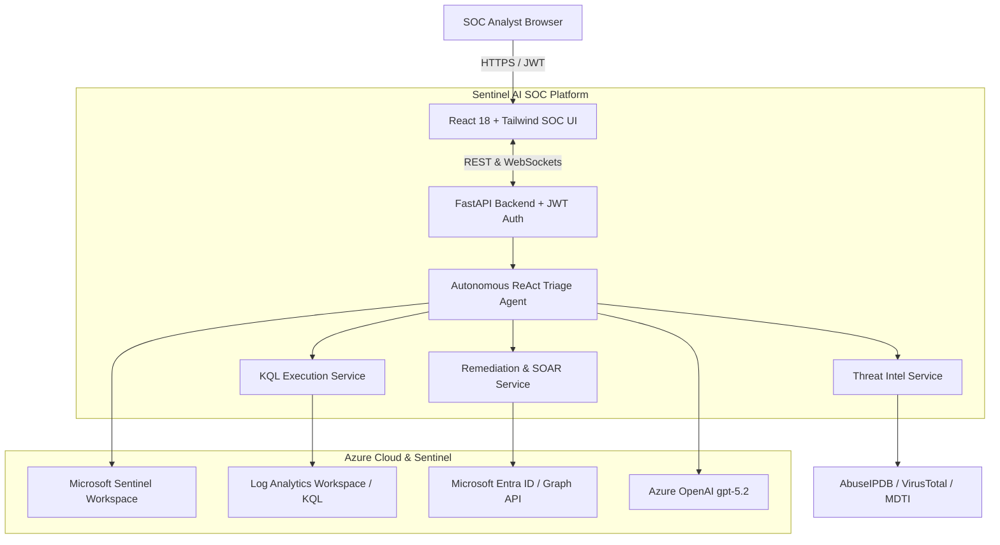

# 🛡️ Microsoft Sentinel AI SOC Agent - Autonomous Incident Triage Platform

An enterprise-grade, autonomous AI SOC analyst agent built for **Microsoft Sentinel**, **Defender XDR**, and **Azure Entra ID**. It features a high-tech dark/light SOC web workbench with authentication, real-time investigation streaming, automated Log Analytics KQL baselining, multi-source threat intelligence correlation, mandatory incident classification, and one-click SOAR remediation actions.

---

## 🚀 Instant 3-Minute Setup Guide

### 🍏 On macOS (New MacBook / Mac Studio)

Open **Terminal** on your Mac (`Cmd + Space` $\rightarrow$ type `Terminal` $\rightarrow$ Enter) and run:

```bash
# Step 1: Install Prerequisites via Homebrew (if not already installed)
brew install python@3.11 node

# Step 2: Clone the Repository
git clone https://github.com/ankush351992/AI-SOC-Agent-for-Microsoft-Sentinel.git
cd sentinel-soc-agent

# Step 3: Setup & Start Backend (Terminal 1)
cd backend
python3.11 -m venv venv
source venv/bin/activate
pip install --upgrade pip
pip install -r requirements.txt
cp .env.example .env    # (Paste your Azure & OpenAI credentials into .env)
uvicorn app.main:app --host 127.0.0.1 --port 8000 --reload
```

In a **New Terminal Tab** (`Cmd + T`):
```bash
# Step 4: Setup & Start Frontend (Terminal 2)
cd sentinel-soc-agent/frontend
npm install
npm run dev
```

> 🌐 Open your browser at **`http://localhost:3000`**

---

### 🪟 On Windows (PowerShell / Windows Terminal)

Open **PowerShell** and run:

```powershell
# Step 1: Clone the Repository
git clone https://github.com/ankush351992/AI-SOC-Agent-for-Microsoft-Sentinel.git
cd sentinel-soc-agent

# Step 2: Setup & Start Backend (PowerShell Window 1)
cd backend
python -m venv venv
.\venv\Scripts\activate
pip install --upgrade pip
pip install -r requirements.txt
Copy-Item .env.example .env    # (Paste your Azure & OpenAI credentials into .env)
uvicorn app.main:app --host 127.0.0.1 --port 8000 --reload
```

In a **Second PowerShell Window**:
```powershell
# Step 3: Setup & Start Frontend (PowerShell Window 2)
cd sentinel-soc-agent\frontend
npm install
npm run dev
```

> 🌐 Open your browser at **`http://localhost:3000`**

---

### 🔑 Default Login Credentials

| Role | Username | Password | Permissions |
| :--- | :--- | :--- | :--- |
| **🛡️ SOC Admin / Lead** | `soc_admin` | `SentinelAdmin2026!` | Full Admin (Triage, Entra ID Assign, Remediation, Settings) |
| **🔍 Tier-2 SOC Analyst** | `analyst` | `Analyst2026!` | Triage, KQL Studio, Investigation Reports & Classification |
| **⚡ Tier-1 Investigator** | `tier1_analyst` | `Analyst2026!` | Incident Queue Monitoring & Triage Review |

*(Pre-filled 1-click login buttons are also available directly on the login screen).*

---

### ⚙️ `.env` Configuration Template

When creating `backend/.env`, populate your Azure and OpenAI keys:

```env
APP_NAME="Microsoft Sentinel AI Triage Platform"
DEMO_MODE=False

# Azure Sentinel Workspace Coordinates
AZURE_SUBSCRIPTION_ID="YOUR_AZURE_SUBSCRIPTION_ID"
AZURE_RESOURCE_GROUP_NAME="YOUR_RESOURCE_GROUP"
AZURE_WORKSPACE_NAME="YOUR_WORKSPACE_NAME"
AZURE_WORKSPACE_ID="YOUR_LOG_ANALYTICS_WORKSPACE_GUID"
AZURE_TENANT_ID="YOUR_AZURE_TENANT_ID"
AZURE_CLIENT_ID="YOUR_AZURE_CLIENT_ID"
AZURE_CLIENT_SECRET="YOUR_AZURE_CLIENT_SECRET"
USE_MANAGED_IDENTITY=False

# Azure OpenAI gpt-5.2 Endpoint & Keys
LLM_PROVIDER="azure_openai"
AZURE_OPENAI_ENDPOINT="https://YOUR_AOAI_RESOURCE.openai.azure.com/"
AZURE_OPENAI_API_KEY="YOUR_AZURE_OPENAI_KEY"
AZURE_OPENAI_DEPLOYMENT_NAME="gpt-5.2"
AZURE_OPENAI_API_VERSION="2024-05-01-preview"

# Threat Intelligence & Automation
ENABLE_MICROSOFT_THREAT_INTEL=True
AUTO_POST_COMMENTS_TO_SENTINEL=True
AUTO_CLOSE_FALSE_POSITIVES=False
```

---

## 🏗️ System Architecture



---

## ✨ Key Platform Capabilities

- **Autonomous Multi-Step Incident Triage**:
  - Extracts incident entities (Users, IPs, Hostnames, Hashes, Processes).
  - Generates & executes contextual KQL queries across `SigninLogs`, `DeviceProcessEvents`, `DeviceNetworkEvents`, `SecurityEvent`.
  - Performs multi-source Threat Intelligence lookups (AbuseIPDB, VirusTotal, MDTI).
  - Assesses **True Positive vs False Positive** probability and maps to **MITRE ATT&CK tactics & techniques**.
  - Synchronizes structured investigation reports as comments to Microsoft Sentinel.
- **Interactive SOC Workbench**:
  - Live execution trace stream (watch the agent's real-time thoughts and tool calls).
  - Interactive AI KQL Query Generator with 1-click live execution against Log Analytics.
  - Entra ID engineer assignment dropdown synced with live tenant directory.
  - Mandatory Close & Classify modal with dynamic reasons and closing audit notes.
- **Production AKS & Cloud Ready**:
  - Includes enterprise Kubernetes manifests (`aks/`) with non-root security context.
  - Verified **CycloneDX v1.5 SBOM** with 0 CVEs.

---

## 🐳 Docker Container Deployment

Run the complete multi-stage container locally using Docker Compose:

```bash
docker-compose up --build
```
Access the dashboard at `http://localhost:8000`.

---

## ☸️ Azure Kubernetes Service (AKS) Deployment

Automated 1-click deployment scripts are located in `aks/`:

```powershell
# PowerShell (Windows)
cd aks
.\deploy-to-aks.ps1 -SubscriptionId "<SUB_ID>" -ResourceGroup "<RG>" -AksClusterName "<AKS_NAME>" -AcrName "<ACR_NAME>"

# Bash (macOS / Linux)
cd aks
chmod +x deploy-to-aks.sh
./deploy-to-aks.sh "<SUB_ID>" "<RG>" "<AKS_NAME>" "<ACR_NAME>"
```

---

## 🧪 Testing

Run backend test suite:
```bash
cd backend
pytest -v
```
